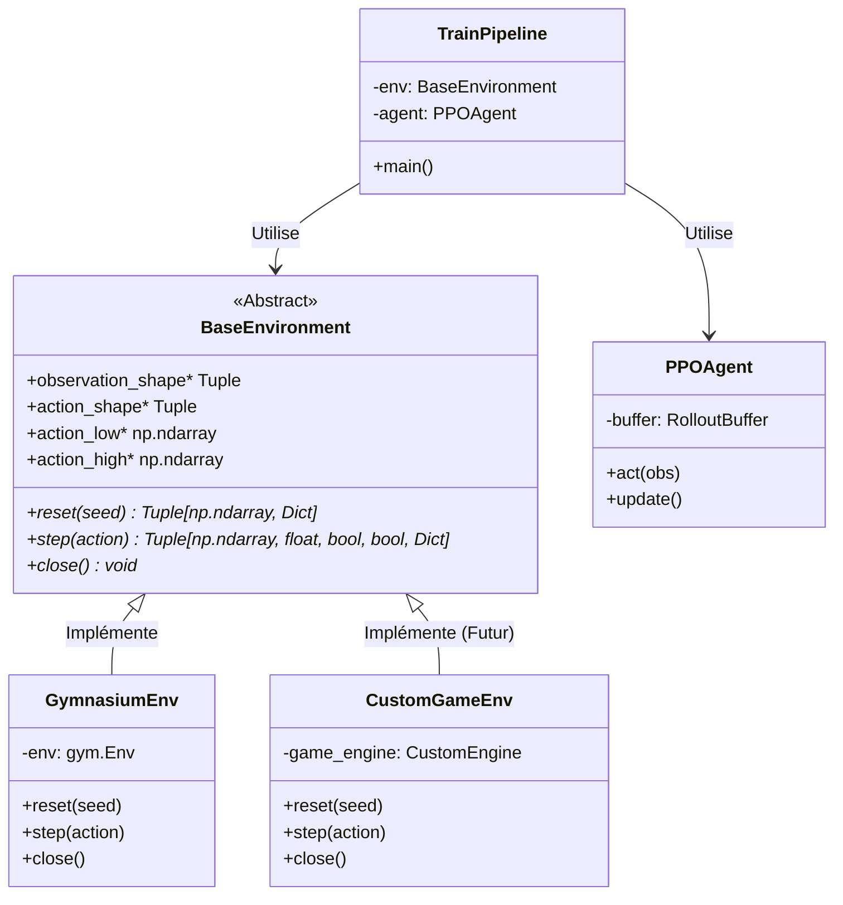

# Rapport sur l'Environnement de Simulation (Environment.md)

Ce document décrit en détail l'environnement de simulation cible actuel du projet **Aletheia Neural Engine**, son rôle dans l'apprentissage de l'agent de contrôle continu, ainsi que l'architecture modulaire mise en place pour permettre sa substitution rapide et indolore par n'importe quel autre système ou moteur de jeu.

---

## 1. L'Environnement Actuel : `BipedalWalker-v3`

L'environnement de référence actuel est **BipedalWalker-v3**, fourni par la bibliothèque standard de recherche en apprentissage par renforcement **Gymnasium** (anciennement OpenAI Gym).

```
   (Coque / Torse)
      /       \
 (Hanche G)  (Hanche D)
    |           |
 (Genou G)   (Genou D)
    |           |
 [Pied G]    [Pied D]
======================== SOL (Terrain accidenté / LiDARs)
```

Il s'agit d'un problème classique de contrôle de locomotion en physique 2D, simulant un robot bipède composé d'une coque centrale (torse) et de deux jambes articulées. L'objectif principal est d'apprendre au robot à se déplacer vers la droite le long d'un terrain accidenté sans tomber.

### A. Espace d'Observation (Taille : 24, Continu)
L'état de l'environnement transmis à l'agent à chaque étape temporelle est un vecteur unidimensionnel de **24 valeurs continues** comprenant :
1. **L'orientation et la dynamique de la coque** (torse) : angle de la coque, vitesse angulaire, vitesses linéaires horizontale et verticale ($x, y$).
2. **La cinématique des articulations** : angles et vitesses angulaires pour les 4 articulations (hanche gauche, genou gauche, hanche droite, genou droit).
3. **Le contact avec le sol** : 2 indicateurs binaires (booléens convertis en réels) indiquant si le pied gauche et le pied droit touchent le sol.
4. **Les capteurs LiDAR** : 10 lectures de capteurs de distance virtuels balayant le secteur avant du robot pour cartographier le profil topographique du terrain (hauteurs et obstacles potentiels).

### B. Espace d'Action (Taille : 4, Continu)
L'agent interagit avec l'environnement en appliquant des forces de torsion. L'espace d'action est un vecteur continu de **4 valeurs** bornées dans l'intervalle **$[-1.0, 1.0]$** :
* Action 0 : Couple moteur appliqué à la hanche gauche.
* Action 1 : Couple moteur appliqué au genou gauche.
* Action 2 : Couple moteur appliqué à la hanche droite.
* Action 3 : Couple moteur appliqué au genou droit.

### C. Fonction de Récompense (Reward Function)
La récompense est conçue pour encourager une marche rapide, stable et économe en énergie :
* **Récompense positive** : Proportionnelle à la distance parcourue vers l'avant (jusqu'à $+300$ points si le robot atteint la ligne d'arrivée).
* **Pénalité motrice** : Une pénalité proportionnelle au carré des couples appliqués (les moteurs consomment de l'énergie). Cela pousse l'IA à trouver des démarches fluides et naturelles plutôt que des mouvements saccadés et énergivores.
* **Pénalité de chute** : Si le corps du robot (la coque) entre en contact avec le sol, l'épisode se termine immédiatement sur une pénalité sévère de **$-100$ points**.

---

## 2. Architecture de Découplage de l'Environnement

L'une des plus grandes forces du projet **Aletheia Neural Engine** réside dans son architecture logicielle hautement découplée. Le modèle d'intelligence artificielle et son algorithme d'apprentissage n'ont absolument aucune connaissance des spécificités internes de Gymnasium.

Cette étanchéité est assurée par une interface abstraite et un modèle de conception (design pattern) de type **Adaptateur** :



### L'Interface Boundary (`env_interface.py`)
Toute communication passe par la classe abstraite `BaseEnvironment`. Elle définit le contrat strict que tout simulateur doit respecter :

* **`reset(seed)`** : Initialise ou réinitialise la simulation physique et renvoie l'état initial.
* **`step(action)`** : Avance la simulation d'un pas de temps en appliquant l'action fournie et renvoie le tuple standard de RL : `(next_state, reward, terminated, truncated, info)`.
* **`close()`** : Libère les ressources système ou ferme les fenêtres graphiques.
* **Propriétés de configuration** : Permettent à l'agent de s'auto-dimensionner automatiquement selon les formes (`observation_shape`, `action_shape`) et les limites physiques (`action_low`, `action_high`) de l'espace d'action.

---

## 3. Remplacement de l'Environnement : Facilité et Procédure

Grâce à cette interface de couplage lâche, **il est extrêmement facile de remplacer l'environnement actuel par un autre**. Vous pouvez swapper Gymnasium pour un simulateur 2D personnalisé écrit en Pygame, un moteur de rendu 3D en C++, ou même un client réseau connecté à un émulateur externe.

### Procédure de Remplacement pas-à-pas :

#### Étape 1 : Créer l'adaptateur de votre nouvel environnement
Créez un nouveau fichier Python, par exemple `custom_game_env.py`, et implémentez l'interface `BaseEnvironment` :

```python
# custom_game_env.py
import numpy as np
from typing import Tuple, Dict, Any
from env_interface import BaseEnvironment
# Importez votre propre moteur de jeu ici !
from my_custom_engine import MyGameSimulator 

class CustomGameEnv(BaseEnvironment):
    def __init__(self, config_params: dict):
        self.game = MyGameSimulator(config_params)
        
    def reset(self, seed: int = None) -> Tuple[np.ndarray, Dict[str, Any]]:
        raw_obs, info = self.game.restart(seed=seed)
        # Convertir les données brutes du jeu en tableau numpy unidimensionnel
        state = self._process_obs(raw_obs) 
        return state, info
        
    def step(self, action: np.ndarray) -> Tuple[np.ndarray, float, bool, bool, Dict[str, Any]]:
        # Appliquer l'action continue dans votre jeu
        raw_next_obs, reward, is_done, debug_dict = self.game.tick(action)
        
        state = self._process_obs(raw_next_obs)
        terminated = is_done
        truncated = False # Gérer les limites de temps si nécessaire
        
        return state, reward, terminated, truncated, debug_dict
        
    def close(self) -> None:
        self.game.shutdown()
        
    @property
    def observation_shape(self) -> Tuple[int, ...]:
        return (self.game.obs_dimension,) # ex: (12,)
        
    @property
    def action_shape(self) -> Tuple[int, ...]:
        return (self.game.action_dimension,) # ex: (2,)
        
    @property
    def action_low(self) -> np.ndarray:
        return np.array([-1.0, -1.0])
        
    @property
    def action_high(self) -> np.ndarray:
        return np.array([1.0, 1.0])

    def _process_obs(self, raw_obs) -> np.ndarray:
        # Code utilitaire pour standardiser les données
        return np.array(raw_obs, dtype=np.float32)
```

#### Étape 2 : Connecter le nouvel environnement dans le script d'entraînement
Dans `train.py` (ou `evaluate.py`), modifiez uniquement l'importation et la ligne d'initialisation de l'environnement :

```python
# train.py (Lignes 79-82)

# --- AVANT ---
# from gym_env import GymnasiumEnv
# env = GymnasiumEnv(config.env_id)

# --- APRÈS ---
from custom_game_env import CustomGameEnv
env = CustomGameEnv(config_params={"difficulty": "normal"})
```

#### Étape 3 : Exécuter l'entraînement
Lancez simplement `python train.py`. 
L'agent `PPOAgent` va interroger l'environnement via les propriétés `observation_shape` et `action_shape`. Il va automatiquement dimensionner ses réseaux de neurones (l'acteur et le critique) pour correspondre à vos nouvelles dimensions. Le `RolloutBuffer` ajustera ses tenseurs d'enregistrement en conséquence. L'entraînement commencera immédiatement sur votre nouveau jeu, sans avoir touché à une seule ligne du code de l'IA !
