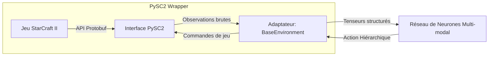
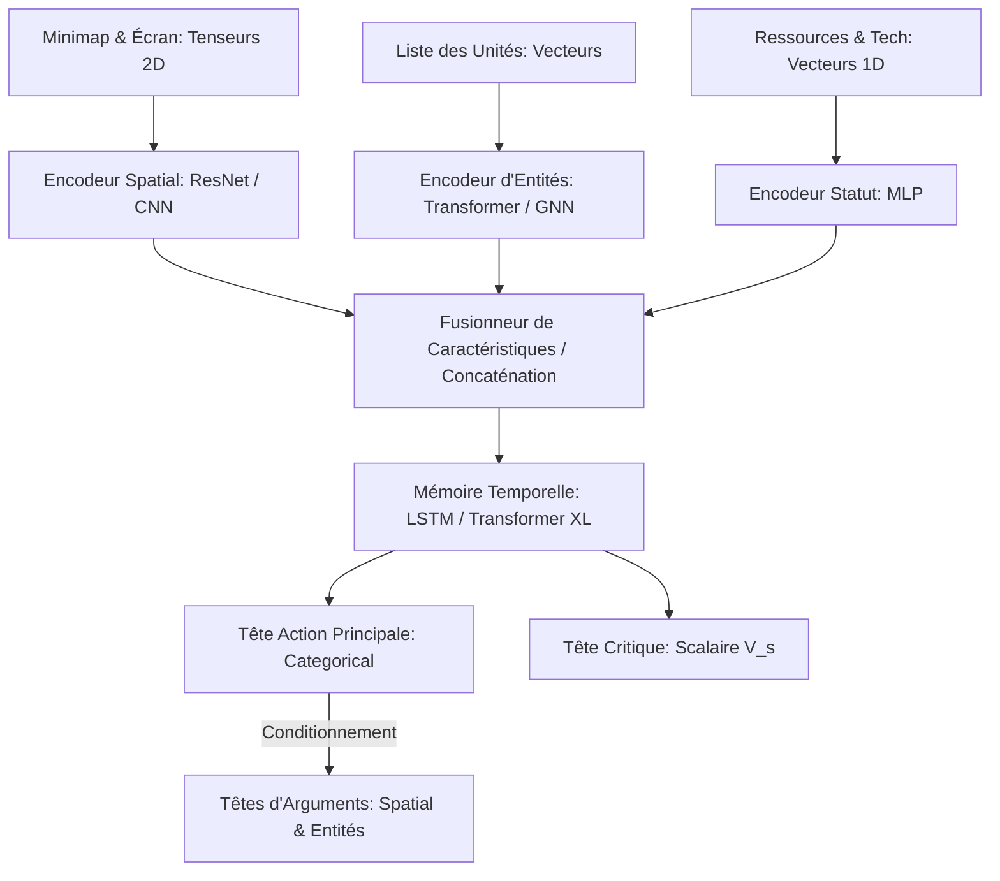

# Feuille de Route pour StarCraft II (RoadMap.md)

Ce rapport dresse la feuille de route stratégique et technologique pour adapter le projet de Reinforcement Learning actuel (conçu à l'origine pour un problème de locomotion simple comme `BipedalWalker-v3`) et le rendre applicable au jeu de stratégie en temps réel (RTS) complexe **StarCraft II**.

---

## 1. L'Abîme Complexité : BipedalWalker vs StarCraft II

Pour réussir ce portage, il est crucial de mesurer l'écart de complexité colossal entre les deux tâches :

| Caractéristique | BipedalWalker-v3 | StarCraft II |
| :--- | :--- | :--- |
| **Espace d'Observation** | Vecteur continu simple (taille 24). | Images multi-couches + Listes d'entités + Variables de statut. |
| **Espace d'Action** | Vecteur continu homogène fixe (taille 4). | Espace combinatoire et hiérarchique (millions de choix par frame). |
| **Observabilité** | Parfaite (pas de brouillard de guerre). | Partielle (brouillard de guerre, nécessite une mémoire à long terme). |
| **Rareté des Récompenses** | Dense (récompenses immédiates à chaque pas). | Extrêmement diluée (+1/-1 en fin de partie après ~20 000 frames). |
| **Dynamique** | Physique 2D statique et prédictible. | Stratégique, multi-agents, asymétrique et adversative. |

---

## 2. Phase 1 : Migration de l'Environnement vers `PySC2`

Le remplacement de Gymnasium se fera en intégrant **PySC2**, l'interface officielle développée par DeepMind et Blizzard.



### A. Structuration des Observations Spatiales et Non-Spatiales
Dans StarCraft II, l'observation reçue par l'agent à chaque étape se décompose en plusieurs flux :
1. **Cartes d'Écran et de Mini-carte (Spatiales) :** Des matrices de pixels représentant l'élévation du terrain, la visibilité (brouillard), l'alliance des unités (allié, ennemi, neutre) et le type d'unités.
2. **Données de Statut (Non-Spatiales) :** Quantité de minerai et de gaz vespène, niveau de population actuel (supply), unités sélectionnées, et l'arbre technologique débloqué.
3. **Listes d'Entités :** Une liste dynamique contenant chaque unité visible à l'écran avec ses attributs (coordonnées X/Y, points de vie, bouclier, type d'unité, niveau d'énergie).

### B. Frame Skipping (Saut d'images)
StarCraft II s'exécute par défaut à 22.4 étapes de simulation par seconde (en vitesse "Faster"). Faire inférer l'IA à chaque frame est inutile stratégiquement et prohibitif en calcul. L'adaptateur devra appliquer un **Frame Skipping** (ex: ne prendre une décision que toutes les 8 à 16 frames, soit environ 2 à 3 actions par seconde), tout en répétant la dernière commande ou en laissant les unités exécuter leurs ordres entre-temps.

---

## 3. Phase 2 : Refactorisation de l'Espace d'Actions (Politique Autorégressive)

Dans BipedalWalker, l'IA produit simplement 4 valeurs réelles. Dans StarCraft II, une action est **hiérarchique et contextuelle** :
$$\text{Action} = (\text{Type d'action}, \, \text{Sélection d'unité}, \, \text{Cible spatiale X/Y}, \, \text{Cible d'entité})$$

### A. Échantillonnage Autorégressif
Le réseau ne peut pas prédire toutes ces variables d'un coup de manière indépendante. Nous devons concevoir une **tête d'action autorégressive** :
1. Le réseau prédit d'abord la commande principale à effectuer (ex: "Construire Bâtiment").
2. En fonction de ce choix, il conditionne ses prédictions suivantes pour choisir les arguments requis (ex: "Quel bâtiment ?" $\rightarrow$ "Caserne" ; "Où sur la carte ?" $\rightarrow$ "Coordonnées X, Y").

### B. Masquage d'Actions (Action Masking)
À tout moment $T$, seules certaines actions sont valides (par exemple, vous ne pouvez pas produire un Marine si vous n'avez pas de Caserne ou si vous manquez de ressources). L'adaptateur de l'environnement devra fournir un **masque binaire d'actions disponibles**. Ce masque sera appliqué sur les sorties logits du réseau (en remplaçant les valeurs des actions interdites par $-\infty$ avant la fonction Softmax) afin de forcer l'agent à ne choisir que des actions physiquement réalisables.

---

## 4. Phase 3 : Métamorphose de l'Architecture Réseau (Style AlphaStar)

Le réseau MLP simple à deux couches cachées doit être remplacé par une architecture multi-modale complexe capable de fusionner des données hétérogènes :



### Les Composants Majeurs :
1. **Encodeurs Spatiaux (ResNet / CNN) :** Traitent les informations visuelles (écrans, mini-cartes) pour en extraire les relations géographiques (emplacements des bases, goulots d'étranglement).
2. **Encodeur d'Entités (Transformer / GNN) :** Traite la liste des unités visibles. Un bloc d'attention de type Transformer permet de gérer un nombre variable d'unités de manière stable en calculant les relations de proximité et de menace entre elles.
3. **Mémoire Temporelle (LSTM ou Transformer XL) :** Essentielle pour maintenir un état interne des zones de la carte sous le brouillard de guerre. L'IA doit "se souvenir" de ce qu'elle a vu (ex. armée ennemie se déplaçant vers sa base) même si ces unités ont disparu dans le brouillard.
4. **Tête de Sortie Critique multi-têtes :** Pour stabiliser l'apprentissage, le Critique doit prédire plusieurs valeurs décomposées (ex: valeur basée sur l'économie, valeur basée sur l'armée, valeur finale de victoire), plutôt qu'un seul scalaire global.

---

## 5. Phase 4 : Résoudre le Défi de l'Exploration (Sparse Rewards)

Si l'agent commence l'entraînement à partir de zéro avec pour seule récompense la victoire ou la défaite (+1/-1 en fin de partie), il n'apprendra jamais. L'espace de recherche est trop vaste pour que le hasard découvre la séquence d'actions menant à une victoire.

### Étape 1 : Apprentissage par Imitation (Supervised Learning)
La première étape obligatoire consiste à faire du **clonage de comportement** sur une base de données massive de replays de joueurs humains de niveau professionnel :
* Le réseau est entraîné par gradient descendant à prédire les actions qu'un humain a prises dans la même situation (minimisation de la cross-entropie).
* *Résultat :* On obtient un agent "cohérent" qui sait récolter des ressources, construire sa base et produire des unités, bien qu'il ne soit pas encore capable de jouer de manière optimale ou adaptative.

### Étape 2 : Apprentissage par Renforcement et Reward Shaping
Une fois pré-entraîné par imitation, l'agent bascule sur l'apprentissage par renforcement (comme PPO ou V-trace) :
* Pour éviter que l'IA ne dérive et n'oublie les concepts humains, on ajoute une perte de régularisation **Divergence KL** par rapport au modèle supervisé de départ.
* Au début de la phase de RL, on introduit un **Reward Shaping** léger (ex: récompenser la récolte de minerai, la destruction d'unités ennemies).
* Au fur et à mesure de l'entraînement, ces récompenses artificielles sont réduites pour laisser place uniquement à la récompense absolue de victoire/défaite, forçant l'IA à se concentrer uniquement sur le but final.

---

## 6. Phase 5 : Infrastructure Distribuée et Ligue (Self-Play)

L'entraînement synchrone sur une machine locale n'est plus viable. SC2 nécessite une échelle industrielle :

```mermaid
graph TD
    subgraph Acteurs en Parallèle (CPU/GPU)
        A1[Instance SC2: Agent vs Adversaire]
        A2[Instance SC2: Agent vs Adversaire]
        A3[Instance SC2: Agent vs Adversaire]
    end
    
    subgraph Serveur de Paramètres Centralisé (GPU)
        A1 & A2 & A3 --> |Envoi des Rollouts de Trajectoires| Q[Tampon / File d'attente]
        Q --> L[Calcul des Gradients & Optimisation]
        L --> |Mise à jour des poids| P[Poids de la Politique active]
        P --> |Diffusion des poids mis à jour| A1 & A2 & A3
    end
```

### A. Apprentissage Distribué (Framework Ray / RLlib)
Il faut découpler la collecte d'expériences du calcul des gradients en utilisant des architectures distribuées comme **IMPALA** ou **Apex** :
* Des centaines d'acteurs (instances légères du jeu s'exécutant en parallèle sur des grappes de CPU) collectent des trajectoires.
* Ces trajectoires sont envoyées de manière asynchrone à un serveur d'apprentissage centralisé équipé de plusieurs GPU haut de gamme, qui calcule les gradients et met à jour les poids en continu.

### B. Entraînement en Ligue (Self-Play)
Si l'IA s'entraîne uniquement contre un adversaire statique (comme l'IA intégrée au jeu), elle va développer des stratégies très spécifiques ("surapprentissage") faciles à contrer. 
Pour créer une IA de niveau mondial, elle doit participer à une **Ligue d'Auto-apprentissage** (comme l'AlphaStar League) :
1. **Main Agent :** L'agent principal qui s'entraîne en continu.
2. **Self-Play Opponents :** L'agent joue contre des versions antérieures de lui-même pour s'assurer qu'il ne régresse pas et ne réapprenne pas d'anciennes faiblesses.
3. **Exploiter Agents :** Des agents spécialisés entraînés spécifiquement pour détecter et exploiter de manière agressive les failles de l'agent principal (ex: lancer des attaques surprises précoces de type "rush"). Cela force l'agent principal à devenir extrêmement robuste face à toutes les stratégies possibles.
