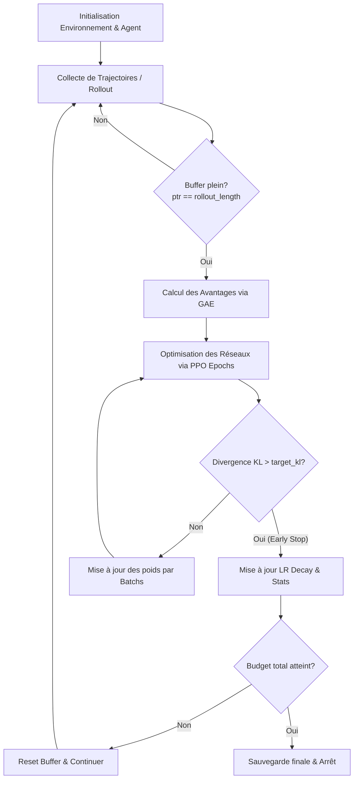

# Rapport d'Entraînement de l'IA (Training.md)

Ce document fournit une analyse technique approfondie du processus d'entraînement de l'agent de Reinforcement Learning (RL) au sein du projet **Aletheia Neural Engine**. L'architecture d'entraînement repose sur l'algorithme **Proximal Policy Optimization (PPO)** implémenté sous PyTorch pour résoudre des tâches de contrôle continu, avec un focus initial sur l'environnement physique de marche bipède (`BipedalWalker-v3`).

---

## 1. Vue d'Ensemble de la Boucle d'Entraînement

L'entraînement de l'agent est orchestré par le script `train.py`. Il s'agit d'un algorithme **on-policy** (sur-politique), ce qui signifie que l'agent apprend uniquement à partir des données générées par sa politique active actuelle. 

Le diagramme suivant illustre le flux opérationnel cyclique de l'entraînement :



### Les Phares Clés du Cycle :
1. **Collecte de trajectoires (Rollout) :** L'agent interagit avec l'environnement sur une longueur fixe définie par `rollout_length` (2048 pas par mise à jour). Durant cette phase, l'acteur échantillonne des actions à l'aide d'une politique stochastique (loi normale) pour encourager l'exploration.
2. **Estimation de valeur terminale (Bootstrapping) :** Pour calculer correctement les retours futurs au-delà de l'horizon de collecte, la valeur du dernier état atteint est estimée par le réseau Critique.
3. **Calcul des Avantages (GAE) :** Les avantages temporels et les retours cibles sont calculés via l'algorithme Generalized Advantage Estimation (GAE).
4. **Mise à jour de la Politique (PPO Updates) :** Le modèle effectue plusieurs passes d'optimisation (`ppo_epochs` = 10) par mini-batchs (taille 64) sur les trajectoires stockées.
5. **Decay Temporel :** Le taux d'apprentissage subit une décroissance linéaire (`lr_decay`) pour stabiliser les phases de convergence tardive.

---

## 2. L'Algorithme PPO & Les Fonctions de Perte (Loss)

L'agent optimise une fonction de perte composite combinant l'objectif de la politique (Acteur), la perte de l'estimateur de valeur (Critique), et une régularisation par l'entropie pour encourager l'exploration.

$$L^{total}_t(\theta, \phi) = L^{clip}_t(\theta) - c_1 \cdot L^{value}_t(\phi) + c_2 \cdot S[\pi_\theta](s_t)$$

### A. Perte de la Politique Écrêtée (Policy Clip Loss : $L^{clip}_t$)
Pour éviter des mises à jour destructrices (problème récurrent dans le RL de gradient de politique classique), PPO introduit un ratio de probabilité entre la nouvelle politique et l'ancienne politique :

$$r_t(\theta) = \frac{\pi_\theta(a_t | s_t)}{\pi_{\theta_{old}}(a_t | s_t)}$$

La perte de l'acteur est alors définie par :
$$L^{clip}_t(\theta) = - \hat{\mathbb{E}}_t \left[ \min\left(r_t(\theta)\hat{A}_t, \, \text{clip}(r_t(\theta), 1 - \epsilon, 1 + \epsilon)\hat{A}_t\right) \right]$$

Dans notre configuration (`config.py`) :
* $\epsilon$ (`clip_epsilon`) = `0.2` : Limite les variations de la politique à $\pm 20\%$.
* $\hat{A}_t$ représente l'avantage estimé pour l'action prise.

### B. Perte du Critique (Value Loss : $L^{value}_t$)
Le réseau Critique estime l'état-valeur $V_\phi(s)$ et cherche à minimiser l'erreur quadratique moyenne (MSE) par rapport aux retours calculés ($\text{Returns} = \hat{A}_t + V_{\phi_{old}}(s_t)$) :

$$L^{value}_t(\phi) = 0.5 \cdot \text{MSE}\left(V_\phi(s_t), \text{Returns}_t\right)$$

* Coefficient $c_1$ (`c1_value_loss_coeff`) = `0.5` : Pondère l'importance de l'apprentissage de la fonction de valeur par rapport au contrôle.

### C. Bonus d'Entropie ($S[\pi_\theta]$)
Pour empêcher la politique de devenir prématurément déterministe (ce qui stopperait l'exploration), un bonus basé sur l'entropie de la distribution gaussienne de l'acteur est ajouté :

$$S[\pi_\theta](s_t) = \text{entropy}(\pi_\theta(\cdot | s_t))$$

* Coefficient $c_2$ (`c2_entropy_coeff`) = `0.01` : Encourage une exploration active au niveau des articulations du robot.

---

## 3. Astuces Technologiques de Stabilisation (Tricks)

Le projet intègre plusieurs optimisations de pointe indispensables pour stabiliser l'apprentissage sur les robots marcheurs (tâches de contrôle continu très instables) :

### 1. Normalisation des Avantages au niveau du Mini-Batch
Dans `agent.py` (Ligne 132) :
```python
advantages = (advantages - advantages.mean()) / (advantages.std() + 1e-8)
```
Plutôt que de normaliser les avantages sur l'ensemble du buffer de rollout, ils sont normalisés spécifiquement pour chaque mini-batch. Cela recentre les gradients à chaque étape d'optimisation et stabilise drastiquement la mise à jour des paramètres de l'acteur.

### 2. Early Stopping basé sur la Divergence KL (Kullback-Leibler)
Dans `agent.py` (Lignes 144-152) :
```python
with torch.no_grad():
    log_ratio = new_log_probs - old_log_probs
    approx_kl = ((torch.exp(log_ratio) - 1) - log_ratio).mean().item()

if hasattr(self.config, 'target_kl') and approx_kl > self.config.target_kl:
    early_stopped = True
    break
```
Si la divergence KL approchée entre la politique actuelle et la politique de référence (au début de la mise à jour) dépasse un seuil tolérable (`target_kl` = 0.015), l'entraînement s'arrête prématurément pour l'époque en cours. Ce mécanisme garantit que la politique ne dérive pas vers des zones d'instabilité numérique irrécupérables.

### 3. Initialisation Orthogonale des Couches
Dans `networks.py` (Lignes 7-14), les poids des réseaux sont initialisés de manière orthogonale avec des gains spécifiques (gain de 0.01 pour la couche de sortie de l'acteur). Cela évite les phénomènes de disparition ou d'explosion de gradients lors des premières étapes de l'entraînement.

### 4. Optimisation Bas Niveau et Gestion Mémoire
* **`set_to_none=True` dans `zero_grad`** : Lors de la rétropropagation (Ligne 170 dans `agent.py`), nous utilisons `set_to_none=True` à la place de la remise à zéro classique. Cela libère les tenseurs de gradient en mémoire au lieu de surcharger la bande passante avec des écritures de zéros, accélérant l'exécution sur GPU.
* **Pré-allocation du tampon d'observation (`_obs_buffer`)** : Un tenseur PyTorch à dimension fixe est pré-alloué sur le périphérique cible (`device`) lors de l'instanciation de l'agent. Lors de l'inférence (`act()`), nous y copions directement les observations NumPy via `.copy_()`, évitant l'instanciation dynamique et coûteuse de nouveaux objets tenseurs à chaque frame de la simulation physique.

---

## 4. Pipeline de Reprise d'Entraînement et Sauvegarde

Le système est conçu pour être résilient aux interruptions matérielles et soutenir des sessions d'entraînement incrémentales :

* **Évaluations régulières :** Toutes les 50 épisodes (`eval_interval_episodes`), la politique est évaluée de manière déterministe sur 5 épisodes (`eval_episodes`). Si le score moyen dépasse le record historique, le point de contrôle est immédiatement sauvegardé dans `checkpoints/opt_ppo_bipedal_best.pt`.
* **Points de contrôle complets (Checkpoints) :** Contrairement aux simples sauvegardes de poids, la méthode `save()` sérialise :
  - Les dictionnaires d'état de l'Acteur et du Critique.
  - L'état interne de l'optimiseur Adam (moments de premier et second ordre).
  - L'état de la configuration hyperparamétrique (`Config`).
  - Des métadonnées cruciales : `global_step` actuel, nombre d'épisodes, meilleur score d'évaluation, nombre de mises à jour effectuées, et historique des récompenses récentes pour la cohérence des graphiques de performance.
* **Reprise d'entraînement automatique (`--resume`) :** Lors de l'appel à `python train.py --resume`, le script recharge l'intégralité du contexte, ré-ajuste automatiquement le budget restant de pas d'entraînement et poursuit l'apprentissage sans aucune discontinuité statistique.
